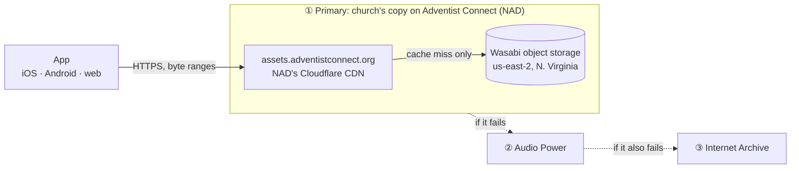

# Adventist Connect media hosting

The app loads the church's own pictures and its primary copy of the Chinese Union
Version (CUV) Bible audio from the church's media library on Adventist Connect, the
North American Division's managed WordPress platform. This page records what is
hosted there, how the request path works, and how much load the setup can be relied
on to carry.

Every `https://assets.adventistconnect.org/newyork2/...` URL in the code points to
this library. The church's site is `newyorkchineseny.adventistchurch.org`, and files
are uploaded through its WordPress media library.

## Contents

- [What is hosted](#what-is-hosted)
- [Request path](#request-path)
- [How the app fetches audio](#how-the-app-fetches-audio)
- [Updating the audio manifest](#updating-the-audio-manifest)
- [Scaling limits](#scaling-limits)
- [Warning signs and fallback plan](#warning-signs-and-fallback-plan)

## What is hosted

| Content | Referenced from | Files | Size |
| --- | --- | --- | --- |
| CUV Bible audio, one MP3 per chapter | [`constants/CuvAdventistAudioManifest.ts`](../../constants/CuvAdventistAudioManifest.ts) | 1,189 | 939 MB total; median 0.73 MB, largest 3.7 MB |
| Church, staff, and fellowship photos | [`constants/ExternalLinks.ts`](../../constants/ExternalLinks.ts) | 6 | 3.2 MB total, 2.3 MB of it one PNG |
| Hymnal number lookup charts | [`features/hymnal/HymnalNumberMappings.json`](../../features/hymnal/HymnalNumberMappings.json) | 2 | 1.1 MB total |

The audio files are 24 kbps mono MP3 (MPEG-2 Layer III, 22.05 kHz), about
**10.8 MB per hour of listening** (3 KB/s per stream). The whole Bible is about 87
hours. Audio is where almost all the bytes go; the images are small and fetched far
less often.

The recordings come from Audio Power, whose owner approved downloading and
self-hosting them ([permission record](https://github.com/New-York-Chinese-Seventh-day-Adventist/sda-church-app/issues/134#issuecomment-5274730608)).
The church also keeps a copy in Google Drive. Where the license allows it, the
church aims to keep at least two copies of media it depends on, on services it
controls (this library and Google Drive). This is best effort, not a complete
backup. Many audio and text sources don't allow separate copies, so the app reads
those directly from third-party API providers.

## Request path

The app tries the sources in order and uses only one at a time; the fallbacks
are not a separate path. See [How the app fetches audio](#how-the-app-fetches-audio)
for when it moves on.

Headers observed on 2026-09-25:

- `server: cloudflare` and `cf-cache-status: HIT` on repeat requests: Adventist
  Connect serves the files through **its own** Cloudflare account, not the
  church's.
- `x-wasabi-cm-reference-id`: the origin is **Wasabi**, an S3-compatible storage
  company that is separate from AWS. The `x-amz-*` headers come from the S3 API
  format, not from Amazon. Wasabi's `us-east-2` is in Northern Virginia; AWS's
  region of the same name is in Ohio.
- `cache-control: max-age=31536000`: files may be cached for a year, so after the
  first request in a Cloudflare data center, later listeners there are served from
  cache without touching Wasabi.
- `accept-ranges: bytes` and `206 Partial Content`: seeking works.

The church has no account with Wasabi or with Adventist Connect's Cloudflare
account, and no service agreement for this hosting. It is part of the conference's
church-website platform.

## How the app fetches audio

- [`BibleAudioSources.ts`](../../services/BibleAudioSources.ts) looks up each
  chapter's Adventist Connect URL in the checked-in manifest and returns it first,
  followed by Audio Power and the Internet Archive copies of the same recording.
- If a source fails, the app moves on to the next one without asking the
  listener. The web player switches as soon as the browser reports a load error.
  On iOS and Android, the Bible screen switches only if a source still hasn't
  started after 45 seconds (`AUDIO_SOURCE_LOAD_TIMEOUT_MS` in
  [`app/(tabs)/bible/index.tsx`](../../app/(tabs)/bible/index.tsx)), so a failed
  primary means a long wait before audio starts. Shortening this is tracked in
  [#262](https://github.com/New-York-Chinese-Seventh-day-Adventist/sda-church-app/issues/262).
  Listeners can also choose a source themselves in the audio settings.
- An Adventist Connect outage therefore shifts load to Audio Power rather than
  stopping playback.
- The player streams with byte-range requests; it does not download chapters for
  offline use.
- The web player preloads only the next chapter. On native, the app queues up to 24
  upcoming chapter descriptors but does not fetch their audio itself.
- The [external dependency monitor](external-dependency-monitor.md) checks that
  the manifest has all 1,189 entries and requests one sampled file a day.

The design reasons for the three-tier setup are in
[Bible integration design](../feature_designs/bible_integration_design.md).

## Updating the audio manifest

1. Download the source recordings with `npm run download:cuv-audio`. Files land in
   the git-ignored `downloads/cuv-audio/` with stable names such as
   `CUV_B01C001.mp3`.
2. Upload them through the church site's WordPress media library, recording the
   browser session as a HAR file.
3. Run `npm run extract:cuv-adventist-manifest` on the HAR to regenerate
   `constants/CuvAdventistAudioManifest.ts`. The script copies only public asset
   URLs; never commit the HAR, which contains session cookies.

WordPress puts an upload timestamp in each URL, so re-uploading a file changes its
URL and the manifest must be regenerated.

## Scaling limits

### Demand

The church has no listening analytics, so these are scenarios rather than
measurements. Traffic is audio bytes delivered to listeners through Cloudflare.

| Scenario | Listening | Per day | Per month | Peak bandwidth |
| --- | --- | --- | --- | --- |
| Congregation | 200 people × 20 min/day | 0.7 GB | ~22 GB | 100 streams ≈ 2.4 Mbps |
| Heavy use | 1,000 people × 30 min/day | 5.4 GB | ~160 GB | 500 streams ≈ 12 Mbps |
| Wide adoption | 10,000 people × 60 min/day | 108 GB | ~3.2 TB | 5,000 streams ≈ 120 Mbps |

Even the last row is modest bandwidth for a CDN. What matters is who pays for it and
under which terms.

### Wasabi (origin storage)

Wasabi doesn't charge for egress or API requests, but its
[pricing FAQ](https://wasabi.com/pricing/faq) expects monthly egress to be no more
than the account's stored volume, and it reserves the right to limit or suspend
accounts that regularly exceed that. It publishes no per-bucket request-rate limit.

Because Cloudflare caches for a year, Wasabi sees roughly one fetch per file per
Cloudflare data center, plus refetches after files are evicted. Congregants are
mostly served from a few New York-area data centers, so a full cache fill costs about
0.94 GB per data center, and most chapters are rarely played. Origin egress should
stay in the **single-digit gigabytes per month no matter how many people listen**.

The ratio applies to Adventist Connect's whole account, which holds media for many
church sites. The church's roughly 1 GB is a very small part of it. **Wasabi is not
the constraint.**

### Cloudflare (Adventist Connect's CDN)

Cloudflare's
[CDN terms](https://www.cloudflare.com/service-specific-terms-application-services/)
let it limit accounts that serve "a disproportionate percentage of pictures, audio
files, or other large files" through the CDN without its paid media products.
Enterprise contracts can differ. Whether this applies depends on Adventist Connect's
plan, which the church can't see. This is the limit most likely to matter.

- **Congregation and heavy use** (tens to low hundreds of GB a month) are ordinary
  traffic for a platform that serves many church websites. It's reasonable to rely
  on this.
- **Wide adoption** (terabytes a month of a single church's audio) could stand out
  to Adventist Connect or Cloudflare. At that point, talk to them or move the
  primary copy (see below).

### Conclusion

For the expected audience, a Chinese-speaking congregation and its extended
community, the current setup has plenty of headroom. The real risks are governance,
not capacity:

- No service agreement: Adventist Connect can change its CDN, move storage, block
  hotlinking, or add bot protection. A browser challenge page would break audio,
  because the app can't solve it.
- Files are tied to the church's WordPress site. If media is purged or the site is
  migrated, every URL changes at once.
- The church can't see traffic figures, so a problem would first show up as failed
  requests, not as a warning.

The Audio Power and Internet Archive fallbacks cover all of these for listeners, at
the cost of sending the load to Audio Power.

## Warning signs and fallback plan

Watch for:

- The dependency monitor reporting `Adventist Connect` failures, especially `403`,
  `429`, or an HTML response where an MP3 was expected.
- Reports that audio takes about 45 seconds to start on phones: the native
  fallback delay, which suggests the primary source is failing.
- Listening growing towards the "wide adoption" row, for example from app store
  install counts.

If Adventist Connect stops being suitable, the design doc allows any public HTTPS
host that serves MP3 with byte-range support. Any replacement must make a bill
impossible, not just unlikely. This is a hard constraint under the "Sustainable"
tenet in [Project Tenets](../project-tenets.md). For that reason, Cloudflare R2 was
considered and rejected: its free tier bills automatically once exceeded, Cloudflare
has no hard spending cap, and the church's Cloudflare account already has a card on
file for the domain. The reasoning is recorded in
[#261](https://github.com/New-York-Chinese-Seventh-day-Adventist/sda-church-app/issues/261).
Whatever the host, moving means uploading `downloads/cuv-audio/`, regenerating the
manifest for the new URLs, and keeping Adventist Connect as a fallback.
